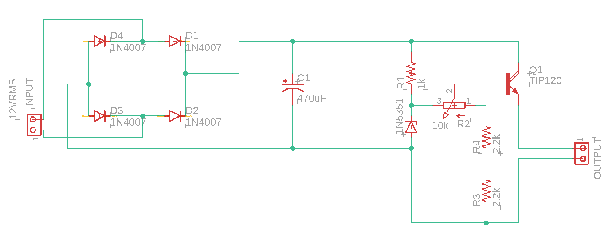

# Fonte de tensão ajustável 3V a 12V

Projeto de uma fonte de tensão ajustáve de 3V a 12V com corrente máxima 100mA.

Realizado para a disciplina de Eletrônica para Computação (SSC-0180) ministrado por Eduardo do Vale Simões.

## Projeto do circuito

O projeto começa pela definição dos componentes necessários para a construção do circuito. Nesse caso, podemos dividir o circuito
em quatro partes principais: transformação, retificação, filtragem e regulagem da tensão.

Ao longo do projeto, diversos componentes foram alterados para melhor cumprir os resultados necessários, desse modo, as decisões não seguem
necessariamente a ordem aqui estabelecida.

### Transformação

Dado que temos como tensão de entrada 127V RMS, precisaremos transformar essa tensão para um valor mais próximo ao nosso destino, para isso podemos utilizar um
transformador 127V/12V. Esse transformador nos proverar tensões de pico de aproximadamente 17V. Esse transformador foi escolhido pois
apresentava margem suficiente para as perdas que teremos mais a frente.

### Retificação

Agora que temos uma tensão mais próxima ao nosso destino, precisamos converter a corrente alternada para corrente contínua. Para isso, utilizaremos uma ponte de diodos.
Pelo uso da ponte de diodos no lugar de um retificador _full-wave_ (que foi impossibilitado pelo transformador a ser utilizado), teremos uma queda de tensão correspondente
a de dois diodos, ou seja, 1,4V.

### Filtragem

A fim de suavizar as oscilações de tensão após a retificação, precisaremos de realizar a filtragem. Para isso, podemos utilizar um capacitor que apresente capacitância suficiente para suportar a carga do circuito durante os períodos de queda na tensão. Quanto maior a capacidade do nosso capacitor, menor será o ripple. No caso, precisamos garantir que teremos pelo menos $14V$. Além disso, dadas as estimativas de consumo que teremos (93,1 mA @ 15,6V), podemos calcular a resistência do circuito como, aproximadamente, 167 Ohms.

Calculando o capacitor mínimo para manter o ripple para até 14V dada resistência do circuito como 167 Ohms, teremos que ter, pelo menos, 461uF.

Sabendo que precisaremos de, no mínimo, 461uF, podemos obter um capacitor de pelo menos 470uF (o mais próximo comercialmente disponível) para suportar a nossa carga.

### Regulagem da tensão

Nesse ponto, temos uma tensão estável de entre 15,6V e 14V. Agora precisamos regulá-la para os valores desejados: de 3V a 12V suportando uma carga de até $100mA$. Para isso, utilizaremos um transistor (no caso, um par de transistores) para regular essa tensão entre os valores desejados. Para definirmos qual será o valor no dreno do transistor, utilizaremos um subcircuito que se conectará ao _gate_ do transistor. Esse subcircuito precisa apresentar uma tensão super estável para que tenhamos uma saída mais limpa possível. Por conta disso, utilizaremos um diodo zener em reverso com uma tensão de ruptura de $14V$, utilizaremos, então um potenciômetro para alternar qual a tensão que teremos no _gate_ e, essa tensão, descartando a queda que teremos nos transistores, controlorá qual a tensão final do circuito.

Aqui, precisamos nos atentar a alguns pontos: primeiro, é importante que limitemos a corrente que chegará no sub-circuito que controlará o _gate_, a fim de evitar uma sobrecarga no zener. Para isso, podemos utilizar um resistor de 1k Ohms. Outro ponto importante é se atentar ao potencial de amplificação e as perdas que teremos no transistor. No caso, para conseguir a corrente necessária na saída com a corrente que teremos na saída do potenciômetro, precisaremos de dois transistores formando um par de Darlington, no caso, utilizaremos um pacote já com o par, o TIP120. No caso do potenciômetro, um de 10k Ohms seguido de dois resistores de 2.2k Ohms (aproximação para resistores comercialmente disponíveis), irá nos prover a corrente necessária para controlar os transistores sob a carga máxima no circuito, nos dando tensões a partir de 3V indo até 12,6V (por conta da queda de tensão nos dois transistores).

Estipulando os consumos teremos:

| Parte                  | Corrente máx. @15,6V |
| ---------------------- | :------------------: |
| Zener e Potentciômetro |       15,6 mA        |
| Perda nos Transistores |        0,5 mA        |
| Carga Máxima           |        77 mA         |
| **Total**              |     **92,1 mA**      |

## Componentes

Segue a tabela com os componentes exatos para a construção do circuito, note que alguns componentes como o capacitor e os diodos estão consideravelmente acima da especificação necessária, podendo ser subsituídos por capacidades menores se o corte em custos justificar a troca.

| Componente                        | Quantidade |                                                                      Preço Un.                                                                       |
| --------------------------------- | :--------: | :--------------------------------------------------------------------------------------------------------------------------------------------------: |
| Transformador 127V/12V 100mA      |     1      |           [R\$19,99](https://www.soldafria.com.br/componentes-eletronicos/transformador/100ma/transformador-12v-100ma-entrada-110-220vac)            |
| Diodo 1N4007                      |     4      |           [R\$0,14](https://www.soldafria.com.br/componentes-eletronicos/diodo/diodo-1nxxxx/diodo-1n4007-retificador-de-uso-geral-1a-700v)           |
| Capacitor Eletrolítico 1000uF 50V |     1      | [R\$2,70](https://www.soldafria.com.br/componentes-eletronicos/capacitor/capacitor-eletrolitico-50v/capacitor-eletrolitico-1000uf-x-50v-p-2883.html) |
| Potenciômetro 10K Logarítmico     |     1      |                                    [R\$1,91](https://www.soldafria.com.br/potenciometro-logaritmo-mini-10ka-l15)                                     |
| Diodo Zener 14V 5W                |     1      |                                    [R\$1,07](https://www.soldafria.com.br/diodo-zener-14v-5w-1n5351-p-7621.html)                                     |
| Transistor TIP120                 |     1      |                                        [R\$1,83](https://www.soldafria.com.br/transistor-tip120-p-1384.html)                                         |
| Resistor 2K2 1/4W                 |     2      |                                  [R\$0,13](https://www.soldafria.com.br/resistor-de-2k2-carbono-5-1-4w-vm-vm-vm-dr)                                  |
| Resistor 1K 1W                    |     1      |                                    [R\$0,18](https://www.soldafria.com.br/resistor-1k-5-1w-mrptvmdr-p-4731.html)                                     |

## Simulação

Segue a simulação do circuito no falstad: [link](http://falstad.com/circuit/circuitjs.html?ctz=CQAgjCAMB0l3BWEAmM0EE4DMGAcB2ZLMSANjABYxkQKsQk6GBTAWjDACgA3EV0iuGp8BILFlJRwIUpHC45iqOk4AVMTQ40Mk8ZLmCYJDHxiQwCIvgwYKpDIWoJIuPgnQIOF6sWQJ8uFhsYPjKNhicAO4igloaQjSQUTFiEvF6UMk6CeCyOUnR2RlgeRlJACa5chnIyLHCNOXMAGYAhgCuADYALpyVJXJxtfU0jS0dPX0ohKmSA7MoIE1tXb2VyDPFeUNL46vJGzQZWJYLBWKncXYjmdEnR2nXZwd1Off5nABODMJxnqMuKQkODJJ5-X7Cc5PDL-Z7dBgYTR5UiveaDPgUWDkSjESw4DYUUIwFF2E6kf5gPCU+LLCa9eEklCvcmSYZAjHQUi4fwBBQSJykfTQfAWSCEXCUrD4OjIWw0vaTaKMkKSRls87KiiCFngLW3GQIOZ6nXIQHnWFxZWQzghQSWVym1z+VmAiDAuDKcwUEwAJWYAGcAJb+7qtAB2AGNmMlYY6GMgHWaY8IYYjntFDYM05mqvqc-NMEjFMkrTRNYYS4aUBQ5Caq+a0xkdWVK7o0s3TZksIIAF7MMPMT7sWLgYU4+2UhPu5BsIkoWAKeBLpcmSjgTg9n4PSSxmuLPsDoeUZOjPexpPfQsoQFXw5SWogy9pu9XspMkFKqt+ST4SCCb-6h2ci-oIWCdkk3y4BQDqvFBrhYH+QIgiUNBwWIiFoe8YwrD0rCdMw-RSIosBcNEhByGyIEoPWySYac5EXIkyRUWBwGdu85wMZRUFMhWZE8WyaHqpwpomO8cTvG+ZhwIS4D4NAuAEAg3J4LYkAbCi0hcAA5tM256WIXJEZwAD2tDaoYtAnEgfjQJKpAis4hJit6iTQKgJQlAQMk6JAniWTQer0AAMiZrTlJwQA)

## Esquemático e PCB

Ambos diagramas do esquemático e da PCB foram feitos no EAGLE e estão disponíveis aqui no repositório.

No caso dos conectores utilizados na PCB, temos dois _MTA02-100_, um para entrada, outro para saída, sendo escolhido pelo baixo custo e apresentar capacidade dentro dos limites do circuito.

### Esquemático

### PCB

## Vídeo explicativo

*Em breve*
